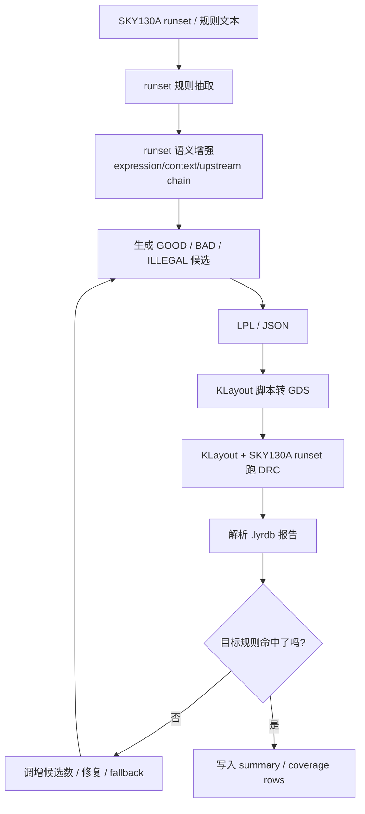

# Auto DRC Pattern

Auto DRC Pattern 是一个面向 `SKY130A` DRC 规则的**版图智能构建与闭环验证**项目。

它的目标不是手工画版图，而是把下面这条链路自动化：

- 读取 DRC 规则 / runset 规则
- 生成带验证意图的版图几何候选（`GOOD / BAD / ILLEGAL`）
- 把几何写成 `LPL / JSON`
- 用 `KLayout` 转成 `GDS`
- 用 `KLayout + SKY130A runset` 跑 DRC
- 判断是否命中目标规则
- 根据反馈继续迭代，直到收敛

这个仓库既可以当作：

- 一个 **DRC 测试版图自动生成器**
- 一个 **SKY130 runset 覆盖 benchmark 系统**
- 一个 **LLM + 规则工程 + DRC 闭环** 的研究原型
- 一个 **后续训练数据、SFT、泛化实验** 的基础平台

---

## 1. 当前项目状态

截至 **2026-03-08**，当前仓库已经整理为适合上传 GitHub 的展示与接手版本。

当前保留的最终 benchmark 结果目录：

- `artifacts/runset_coverage_llm_full_fresh_20260308_coldstart_verify_v2`

另外，我在清理仓库后又重新做了一次完整复验，结果目录为：

- `artifacts/repro_after_cleanup_20260308`

这次复验得到的关键指标如下：

- `total_rules = 279`
- `supported_rules = 279`
- `covered_rules (strict) = 279`
- `covered_rules_relaxed = 279`
- `unique_rule_ids_covered = 261 / 261`
- `status_counts = { covered: 279 }`
- `reason_counts = {}`

对应文件：

- `artifacts/repro_after_cleanup_20260308/coverage_summary.json`

这表示：

> 当前代码已经可以在 `SKY130A` runset 的 `.output(...)` 规则口径下，实现 **strict 279 / 279 全覆盖**。

### 这句话要如何准确理解？

这里的“全覆盖”是指：

- 覆盖 `sky130A_mr.drc` 中所有 `.output(...)` 导出的 DRC 规则；
- 对每条规则都能生成并验证对应测试版图；
- 最终按 `strict` 标准统计为 `279 / 279`。

这**不是**说：

- 已经完整解释了 runset 的全部 Ruby 语义；
- 已经能自动画任意真实芯片版图；
- 已经把所有 PDK 行为都建成完整形式化求值器。

本项目的准确定位是：

> **自动生成并验证一组针对 DRC 规则的测试版图，使其对 SKY130A runset 达到 strict 全覆盖。**

---

## 2. 项目解决的核心问题

传统 DRC 验证有一个长期问题：

- 很多规则需要人工构造测试版图；
- 图样编写耗时，覆盖率低；
- 边界条件、上下文条件、特殊层交互很难手工系统化枚举。

这个项目试图解决的是：

1. 把自然语言规则和 runset 规则语义抽出来；
2. 自动生成“应通过 / 应触发 / 应非法”的版图测试图样；
3. 用真实 DRC 引擎验证这些图样是否真的达到目标；
4. 把结果沉淀为可复现的 benchmark、训练数据和实验基础设施。

---

## 3. 整个项目是怎么运作的

### 3.1 一句话流程

> `规则 → 语义增强 → 候选几何生成 → LPL → GDS → KLayout DRC → 命中判定 → 闭环修正 → 汇总覆盖率`

### 3.2 流程图



### 3.3 每一步分别做什么

#### 第一步：提取 runset 规则

项目会从 `sky130A_mr.drc` 中提取所有 `.output(...)` 规则。

代码入口：

- `autodrc/runset_corpus.py`

它负责拿到：

- `rule_id`
- `description`
- `line_no`
- `layer_hint`
- `threshold_nm`

这一步相当于把庞大的 runset 先整理成一张“待覆盖规则清单”。

#### 第二步：提取 runset 语义上下文

仅有规则描述还不够，因为很多规则依赖：

- 上游 layer alias
- 条件 block（`if / unless / case / do ... end`）
- 表达式引用链
- 语义过滤条件（如 `inside`, `not`, `interacting`, `across`, `areaid` 等）

代码入口：

- `autodrc/runset_semantics.py`

它会提取：

- `expression`
- `context_stack`
- `expression_refs`
- `upstream_assignments`
- `unresolved_refs`

然后 `runset_coverage` 会把这些信息重新拼成增强后的规则文本，再喂给生成系统。

#### 第三步：生成版图候选

这里有两种模式：

##### 模式 A：`template`

- 由既定代码模板直接生成几何；
- 可控、稳定、适合做基线；
- 对简单规则特别有效。

##### 模式 B：`llm`

- 由大模型根据规则文本和 intent 生成 LPL/JSON；
- 模型输出的是多边形坐标，不是自然语言解释；
- 更适合复杂语义、多层约束、上下文敏感规则。

最终 `279 / 279 strict` 的结果是：

> **使用 `llm` 模式跑出来的**。

但要注意，这不是“裸 LLM 单独完成”，而是：

> **LLM 生成 + policy 约束 + repair/fallback + KLayout DRC 闭环** 共同完成的结果。

#### 第四步：写成 LPL / JSON

无论是模板模式还是 LLM 模式，都会先得到统一的中间表示：

- `LPL`（Layout Polygon List）

核心模块：

- `autodrc/lpl.py`

每个 polygon 至少包含：

- `layer`
- `points`

并且会检查：

- 是否闭合
- 是否曼哈顿几何
- 是否有非法边

#### 第五步：LPL 转 GDS

项目不是直接在 KLayout 界面里手画版图。

真实流程是：

- Python 先生成 `LPL / JSON`
- 再调用 `scripts/lpl_to_gds.rb`
- 使用 KLayout 的 Ruby API 把 polygon 写入 GDS

也就是说：

> **版图是自动生成的，KLayout 在这里承担的是“GDS 写出器”和“DRC 执行器”的角色。**

#### 第六步：运行真实 DRC

生成 GDS 后，会调用：

- `KLayout`
- `sky130A_mr.drc`

执行真实 DRC 检查，并输出：

- `.lyrdb` 报告

之后再从报告里解析：

- 总命中数
- 目标 category 命中数
- 是否误命中其他规则

#### 第七步：闭环判断是否收敛

对于每条规则，系统会尝试生成三类案例：

- `GOOD`：应该合法，不应打中目标规则
- `BAD`：应该故意触发目标规则
- `ILLEGAL`：几何本身就应非法

若当前结果不理想，系统会：

- 增大几何偏移量 `delta`
- 增加 `BAD` 候选数
- 对 LLM 输出进行选择和修复
- 对不稳定场景回退到模板 case

最终目标是达到 `strict` 收敛。

---

## 4. 大模型在这个项目里到底做什么

这是最容易误解的地方，所以单独说明。

### 4.1 大模型不是负责“点鼠标画图”

大模型不在 KLayout 界面里画图。

它负责的是：

- 接收规则文本 / runset 语义增强后的文本；
- 根据目标 intent（`GOOD / BAD / ILLEGAL`）生成一份 LPL JSON；
- 输出 polygon 坐标；
- 提供多份候选几何供系统筛选。

### 4.2 固定代码不是让结果完全固定

你可以把系统理解为：

- **固定代码**：定义流程、合法性检查、转换、验证、修复、打分
- **大模型**：提出几何候选
- **KLayout DRC**：充当物理裁判

所以项目不是“版图都写死了”，而是：

- 有一部分规则可以用模板稳定生成；
- 更复杂规则依赖 LLM 给出候选；
- 最终通过工程系统把 LLM 输出驯化成可验证结果。

### 4.3 为什么最终还需要 repair / fallback？

因为 DRC 是高精度任务。

LLM 能提供“几何候选空间”，但不能保证每一次都严格命中目标规则。

所以系统在 LLM 之外还做了：

- 候选评分与选择
- 几何合法性修复
- 上下文 marker 注入
- 必要时退回模板图样

这也是为什么最终成果应被准确描述为：

> **LLM 驱动的闭环版图生成系统**，而不是“纯 LLM 单独画图系统”。

---

## 5. strict / relaxed 是什么意思

### `strict`

这是本项目的最终验收标准。

一条规则被记为 strict covered，通常意味着：

- `GOOD` 样例不触发目标规则；
- `BAD` 样例稳定触发目标规则；
- `ILLEGAL` 样例满足预期非法性；
- 不是“沾边命中”，而是真正符合目标验证意图。

### `relaxed`

这是较宽松的中间分析口径，只适合辅助排查，不适合作为对外最终结论。

当前项目对外应统一表述为：

> **strict = 279 / 279**

---

## 6. 仓库结构说明

当前仓库保留的是最核心、最适合展示和接手的部分：

```text
autodrc/                     核心 Python 源码
config/                      层映射等配置
data/                        示例 case 数据
scripts/                     辅助脚本（训练、环境检查、覆盖执行）
tests/                       单元测试
artifacts/
  repro_after_cleanup_20260308/
                              清理后重新复验得到的完整结果
  runset_coverage_llm_full_fresh_20260308_coldstart_verify_v2/
                              当前保留的最终 benchmark 结果
  previews/
                              渲染出来的示例图片
models/                      可选的本地模型目录（通常不提交到 GitHub）
README.md                    项目总说明
requirements.txt             Python 依赖
plan.docx                    原始研究计划文档
```

### `autodrc/` 中各文件作用

- `lpl.py`：LPL 表示、polygon 校验
- `rules.py`：自然语言规则解析
- `casegen.py`：模板版图生成
- `llm_generator.py`：让 LLM 生成 LPL JSON
- `llm_policy.py`：候选选择、修复、fallback
- `closed_loop.py`：单条规则的闭环执行
- `runset_corpus.py`：提取 `.output(...)` 规则
- `runset_semantics.py`：提取 runset 语义上下文
- `runset_coverage.py`：批量覆盖整个 runset
- `instruction_dataset.py`：构建训练数据
- `generalization.py`：泛化实验
- `discriminator.py`：判别器打分
- `corner_mining.py`：边界样例挖掘
- `validation.py`：指标聚合
- `pipeline.py`：一键执行全流程
- `training_recipes.py`：导出 LoRA / Q-LoRA 配方

---

## 7. 环境要求

### 7.1 必备依赖

如果你只想阅读代码和 README：

- 只需要普通 Python 环境即可

如果你要实际跑完整闭环：

- `python3`（建议 `3.11` 或 `3.12`）
- `KLayout`
- 可访问的 `SKY130A` runset
- 可用的模型权重或 Hugging Face 模型 ID

### 7.2 默认 runset 路径

默认使用：

```text
~/.klayout/salt/Efabless_sky130/tech/sky130/drc/sky130A_mr.drc
```

如果你的 runset 不在这里，需要手动传：

```bash
--runset /path/to/sky130A_mr.drc
```

### 7.3 模型说明

本项目约定本地模型可放在 `models/` 目录下，例如：

- `models/TinyLlama-1.1B-Chat-v1.0`

你也可以改用别的模型，例如：

- `Qwen/Qwen2.5-3B-Instruct`
- 你自己的本地模型路径

脚本 `scripts/run_coverage_llm_gpu_fast.sh` 的默认行为是：

1. 如果你已经激活了虚拟环境，就直接用当前环境；
2. 否则尝试 `.venv-gpu`；
3. 再尝试 `.venv`；
4. 模型优先使用 `AUTO_DRC_LLM_MODEL`；
5. 若未设置，则优先找本地模型目录；
6. 最后再回落到远程 Hugging Face 模型 ID。

---

## 8. 安装方式

### 8.1 CPU 版（适合阅读、跑测试、做轻量实验）

```bash
python3 -m venv .venv
source .venv/bin/activate
python -m pip install --upgrade pip setuptools wheel
python -m pip install -r requirements.txt
```

### 8.2 GPU 版（推荐，用于 LLM 覆盖实验）

```bash
python3 -m venv .venv-gpu
source .venv-gpu/bin/activate
python -m pip install --upgrade pip setuptools wheel
python -m pip install -r requirements.txt
```

然后把 `torch / torchvision / torchaudio` 替换成与你本机 CUDA 对应的 GPU 版本。

> 上传到 GitHub 时通常**不应提交** `.venv*` 或大模型权重；接手者应按本 README 自行创建环境并准备模型。

---

## 9. 先从哪里启动

如果你是第一次接手，推荐按这个顺序：

### 第一步：检查环境

```bash
./scripts/task1_env_check.sh
```

### 第二步：跑测试

```bash
python3 -m unittest discover -s tests -p "test_*.py"
```

当前测试状态：

- `Ran 95 tests`
- `OK`

### 第三步：先跑一个最小 smoke test

```bash
source .venv-gpu/bin/activate
AUTO_DRC_LLM_MODEL="models/TinyLlama-1.1B-Chat-v1.0" \
./scripts/run_coverage_llm_gpu_fast.sh \
  --out-dir artifacts/smoke_dnwell \
  --rule-id dnwell.1 \
  --max-iters 1
```

### 第四步：再跑完整 benchmark

```bash
source .venv-gpu/bin/activate
AUTO_DRC_LLM_MODEL="models/TinyLlama-1.1B-Chat-v1.0" \
AUTO_DRC_LLM_BAD_CANDIDATES=4 \
AUTO_DRC_LLM_CANDIDATE_GROWTH=2 \
AUTO_DRC_LLM_MAX_CANDIDATES_PER_INTENT=8 \
./scripts/run_coverage_llm_gpu_fast.sh \
  --out-dir artifacts/my_full_run \
  --initial-delta-nm 100 \
  --max-iters 3
```

---

## 10. 主要入口（Entry Points）

这一节是给 GitHub 接手者看的。

### 10.1 入口：生成基础 LPL case

```bash
python3 -m autodrc.cli \
  --rule-text "Minimum width 0.14um on met1" \
  --out-dir data/seed_cases
```

用途：

- 快速理解项目最基本的数据格式；
- 生成 `GOOD / BAD / ILLEGAL` 三个 JSON case；
- 适合第一步入门。

### 10.2 入口：单条规则闭环执行

模板模式：

```bash
python3 -m autodrc.closed_loop \
  --rule-text "Minimum width 0.14um on met1" \
  --out-dir runs/met1_min_width
```

LLM 模式：

```bash
python3 -m autodrc.closed_loop \
  --generator llm \
  --llm-model "models/TinyLlama-1.1B-Chat-v1.0" \
  --rule-text "Minimum width 0.14um on met1" \
  --out-dir runs/met1_min_width_llm
```

用途：

- 看单条规则如何从生成走到 DRC；
- 调试具体 rule 的最方便入口。

### 10.3 入口：提取 runset 规则表

```bash
python3 -m autodrc.runset_corpus \
  --runset ~/.klayout/salt/Efabless_sky130/tech/sky130/drc/sky130A_mr.drc \
  --out-catalog artifacts/data/rule_to_runset/catalog.jsonl \
  --out-pretrain artifacts/data/rule_to_runset/pretrain.jsonl
```

用途：

- 把 runset 规则导出成结构化清单；
- 为训练和 benchmark 提供统一输入。

### 10.4 入口：提取 runset 语义

```bash
python3 -m autodrc.runset_semantics \
  --runset ~/.klayout/salt/Efabless_sky130/tech/sky130/drc/sky130A_mr.drc \
  --out-jsonl artifacts/runset_semantics.jsonl \
  --out-blocks-jsonl artifacts/runset_blocks.jsonl
```

用途：

- 把 runset 的上下文条件和上游依赖补全出来；
- 提高复杂规则生成质量。

### 10.5 入口：覆盖整个 runset

底层 Python 入口：

```bash
python3 -m autodrc.runset_coverage \
  --generator llm \
  --llm-model "models/TinyLlama-1.1B-Chat-v1.0" \
  --out-dir artifacts/full_coverage \
  --initial-delta-nm 100 \
  --max-iters 3
```

推荐脚本入口：

```bash
./scripts/run_coverage_llm_gpu_fast.sh \
  --out-dir artifacts/full_coverage \
  --initial-delta-nm 100 \
  --max-iters 3
```

用途：

- 这是最关键的 benchmark 入口；
- 用于生成覆盖全 runset 的最终结果。

### 10.6 入口：一键全流程

模板版：

```bash
python3 -m autodrc.pipeline --out-root artifacts/full_pipeline
```

LLM 版：

```bash
python3 -m autodrc.pipeline \
  --out-root artifacts/full_pipeline_llm \
  --generator llm \
  --llm-model "models/TinyLlama-1.1B-Chat-v1.0"
```

用途：

- 适合一次性串起语料、闭环、验证、泛化、训练配方导出。

### 10.7 入口：训练数据与 SFT

导出 instruction / feedback：

```bash
python3 -m autodrc.instruction_dataset \
  --out-instruction artifacts/data/instruction_tuning/instruction.jsonl \
  --out-feedback artifacts/data/instruction_tuning/feedback.jsonl \
  --runs-root runs \
  --include-unknown
```

导出训练配方：

```bash
python3 -m autodrc.training_recipes \
  --out artifacts/config/training_recipes.json \
  --train-jsonl artifacts/data/instruction_tuning/instruction.jsonl \
  --output-dir artifacts/runs/training
```

SFT 训练：

```bash
python3 scripts/train_sft.py \
  --model "TinyLlama/TinyLlama-1.1B-Chat-v1.0" \
  --train-jsonl artifacts/data/instruction_tuning/instruction.jsonl \
  --output-dir artifacts/runs/training/mock_run \
  --backend mock
```

用途：

- 用于做训练、A/B、模型迁移和后续研究扩展。

---

## 11. 如何复现当前最终结果

### 11.1 推荐命令

```bash
source .venv-gpu/bin/activate
AUTO_DRC_LLM_MODEL="models/TinyLlama-1.1B-Chat-v1.0" \
AUTO_DRC_LLM_BAD_CANDIDATES=4 \
AUTO_DRC_LLM_CANDIDATE_GROWTH=2 \
AUTO_DRC_LLM_MAX_CANDIDATES_PER_INTENT=8 \
./scripts/run_coverage_llm_gpu_fast.sh \
  --out-dir artifacts/reproduce_279_full \
  --initial-delta-nm 100 \
  --max-iters 3
```

### 11.2 复现成功后看什么

先看：

- `artifacts/reproduce_279_full/coverage_summary.json`

如果你只想确认是否成功，主要看：

- `covered_rules`
- `total_rules`
- `covered_rules_relaxed`
- `status_counts`
- `reason_counts`

### 11.3 如果中途中断怎么办

可以在同一输出目录上续跑：

```bash
source .venv-gpu/bin/activate
AUTO_DRC_LLM_MODEL="models/TinyLlama-1.1B-Chat-v1.0" \
AUTO_DRC_LLM_BAD_CANDIDATES=4 \
AUTO_DRC_LLM_CANDIDATE_GROWTH=2 \
AUTO_DRC_LLM_MAX_CANDIDATES_PER_INTENT=8 \
./scripts/run_coverage_llm_gpu_fast.sh \
  --out-dir artifacts/reproduce_279_full \
  --initial-delta-nm 100 \
  --max-iters 3 \
  --resume
```

---

## 12. 输出结果怎么看

### 12.1 最重要的总表

- `coverage_summary.json`

它告诉你：

- 总规则数
- 支持规则数
- strict / relaxed 覆盖数
- 语义字段是否对齐
- reason 统计

### 12.2 每条规则的细节

- `coverage_rows.jsonl`

每一行是一条规则，里面包含：

- `rule_id`
- `description`
- `runset_expression`
- `runset_context_stack`
- `runset_upstream_assignments`
- `status`
- `reason`
- `run_dir`

### 12.3 单条规则的运行目录

在：

- `rules/<rule_id>/`

你会看到：

- `summary.json`
- `iter_01/`
- `iter_02/`
- `iter_03/`

每一轮里通常包含：

- `cases/*.json`
- `gds/*.gds`
- `reports/*.lyrdb`
- `logs/*.log`
- `iteration_summary.json`

---

## 13. 怎么看生成出来的版图

### 13.1 直接看 GDS

比如：

- `artifacts/repro_after_cleanup_20260308/rules/via.3/iter_01/gds/via_min_width_bad_llm.gds`

可以直接用 `KLayout` 打开。

### 13.2 直接看渲染后的 PNG

仓库里也保留了示例渲染图：

- `artifacts/previews/via_min_width_bad_llm.png`

这张图对应的原始 GDS 是：

- `artifacts/repro_after_cleanup_20260308/rules/via.3/iter_01/gds/via_min_width_bad_llm.gds`

### 13.3 如何理解这些图

这些图不是功能版图，而是：

- 面向规则验证的测试图样；
- 用于故意构造通过 / 违例 / 非法场景；
- 核心目的是命中或避免命中 DRC 规则。

---

## 14. 接手这个项目时建议怎么做

如果你准备长期接手，建议按下面顺序：

1. 读完本 README
2. 跑 `./scripts/task1_env_check.sh`
3. 跑单测
4. 跑单规则 smoke test
5. 打开一个 `rules/<rule_id>/summary.json`
6. 再跑一次完整 `runset_coverage`
7. 最后再去看训练、泛化和 batch sweep

### 最值得先读的源码文件

按推荐顺序：

1. `autodrc/cli.py`
2. `autodrc/casegen.py`
3. `autodrc/llm_generator.py`
4. `autodrc/llm_policy.py`
5. `autodrc/closed_loop.py`
6. `autodrc/runset_corpus.py`
7. `autodrc/runset_semantics.py`
8. `autodrc/runset_coverage.py`

这样最容易理解：

- 几何是怎么来的；
- LLM 在哪里参与；
- KLayout 在哪里参与；
- strict 覆盖率是怎么统计出来的。

---

## 15. 常见问题（FAQ）

### Q1：最终 `279 / 279 strict` 是不是 LLM 模式跑出来的？

是的。

但准确表述是：

> `llm` 模式 + repair/fallback + KLayout DRC 闭环

而不是“裸 LLM 单独画图”。

### Q2：这个项目是不是用 KLayout 手工画版图？

不是。

真实流程是：

- Python / LLM 先生成多边形几何
- 写成 LPL / JSON
- KLayout Ruby 脚本把它们写成 GDS
- KLayout 再用 runset 做 DRC

### Q3：代码模板这么多，那结果是不是固定的？

不是完全固定。

- `template` 模式下更固定；
- `llm` 模式下几何候选来自模型生成；
- 系统再对这些候选做筛选、修复和闭环验证。

### Q4：这个项目能不能直接用于真实芯片版图设计？

不能直接这么理解。

它的重点是：

- 构造 DRC 规则测试图样；
- 验证规则覆盖率；
- 为训练和规则理解提供数据与系统基础。

### Q5：仓库里是否包含完整 PDK？

不包含。

你需要自己准备：

- `SKY130A` runset
- 对应本地环境
- 如需更换模型，则需要自己准备模型权重

---

## 16. 当前限制与后续方向

虽然当前结果已经达到 strict 279 / 279，但仍有这些边界：

- 目前“全覆盖”口径是 runset 的 `.output(...)` 规则，而不是完整 Ruby 解释器级别全覆盖；
- 系统仍然是混合式架构，不是纯端到端 LLM；
- 泛化规则集合还比较有限；
- 非曼哈顿、多层复杂约束还有继续扩展空间；
- 更强模型的 A/B 和训练闭环仍值得继续推进。

后续接手时最自然的方向有三个：

1. 更强开源模型对比（如更强 Qwen 系列）
2. 把训练与闭环反馈真正做成稳定增益
3. 拓展到更多未知规则和更复杂几何语义

---

## 17. 给 GitHub 访问者的最短说明

如果你只想知道这个项目值不值得看，最短总结如下：

> 这是一个利用 LLM 与 KLayout DRC 闭环自动生成验证版图的项目。
> 它面向 `SKY130A` runset 的 `.output(...)` 规则，当前已经验证达到 **strict 279 / 279 全覆盖**。
> 项目既能单条规则调试，也能批量跑完整 runset benchmark，还能导出训练数据和训练配方。

如果你只想看结果：

- 打开 `artifacts/repro_after_cleanup_20260308/coverage_summary.json`

如果你只想看一个具体版图：

- 打开 `artifacts/previews/via_min_width_bad_llm.png`

如果你想开始接手：

- 从 `./scripts/task1_env_check.sh` 和 `python3 -m unittest discover -s tests -p "test_*.py"` 开始。
